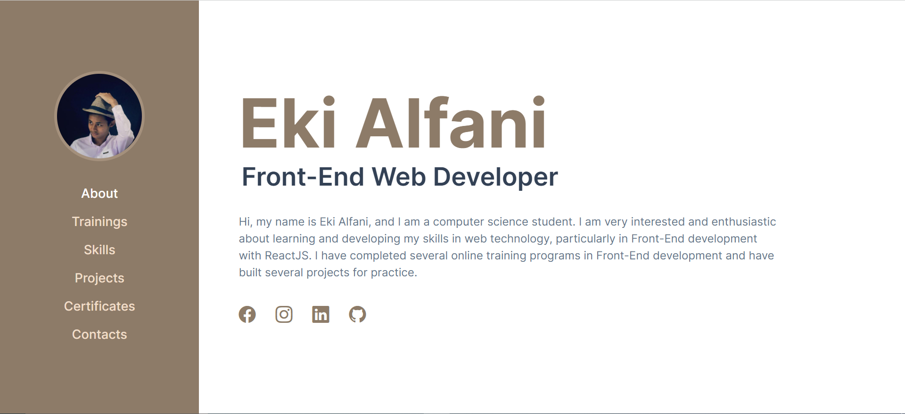

<h1 align="center">Portfolio</h1>
<div align="center">
  

  <br />
  <br />

  <p>This is my portfolio, which showcases some of my projects and provides information about my skills.</p>

  <br />
  <br />
  <a href="https://ekialfani.netlify.app/" target="_blank" rel="noopener">
    <button style="background-color: #4CAF50; color: white; padding: 12px 24px; border: none; border-radius: 4px; cursor: pointer;">
      View Project
    </button>
  </a>
</div>

<br />
<br />

## Built With
- Tailwindcss
- ReactJS

## Installation
* Clone the repo
  ```sh
  git clone https://github.com/ekialfani/portfolio.git
  ```
* Install dependencies
  ```sh
  npm install
  #or
  yarn install
  ```
* Run the project
  ```sh
  npm start
  #or
  yarn start
  ```

##  Contributing
1. Fork the project
2. Create your feature branch (`git checkout -b my-new-feature`)
3. Commit to the branch (`git commit -am 'Add some feature'`)
4. Push to the branch (`git push origin my-new-feature`)
5. Create a new pull request

## Credits
This application was created by <a href="https://www.instagram.com/ekialfni/" target="_blank" rel="noreferrer">Eki Alfani</a>.